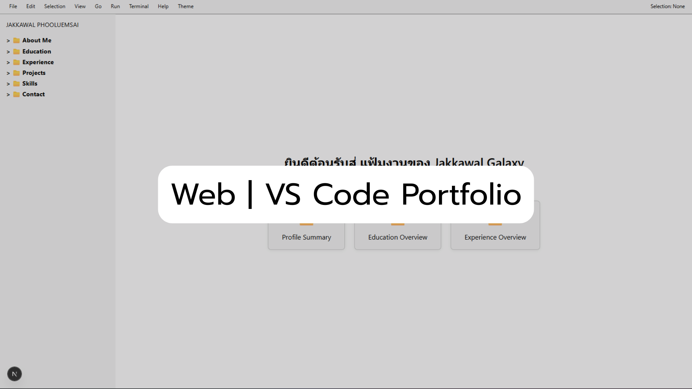
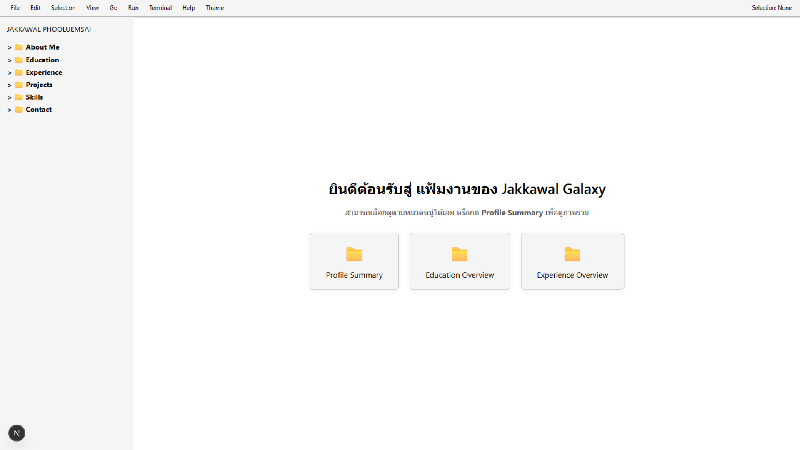
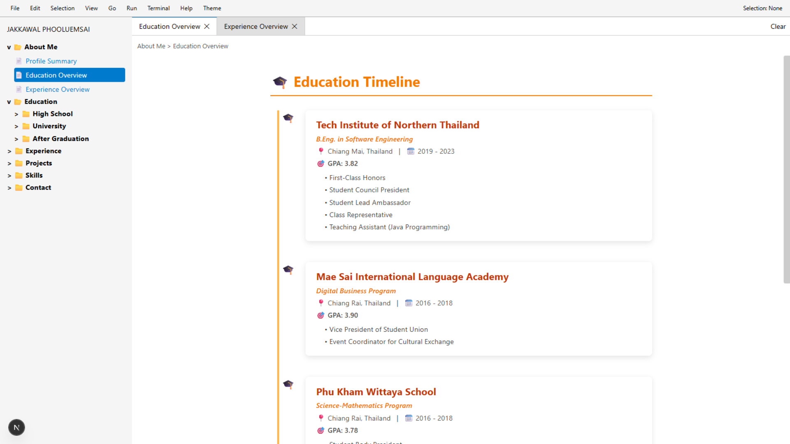
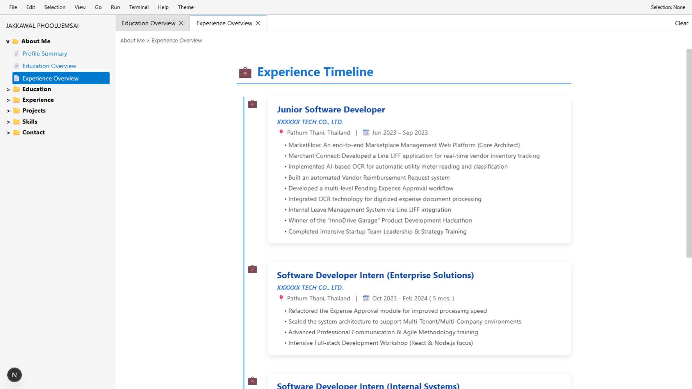
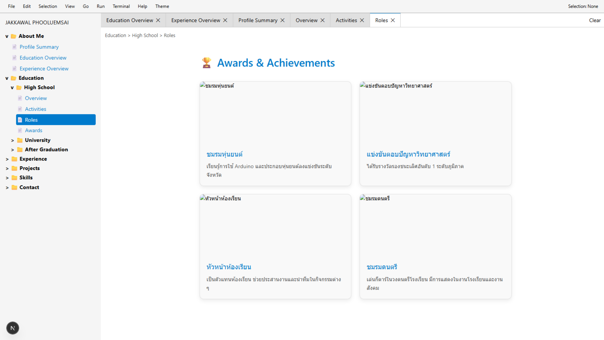
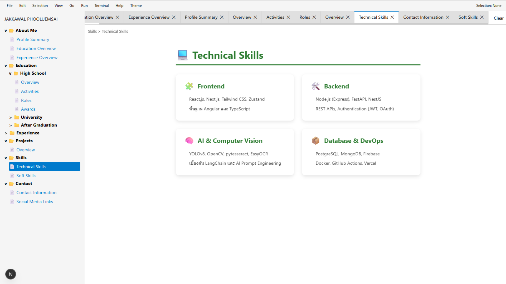
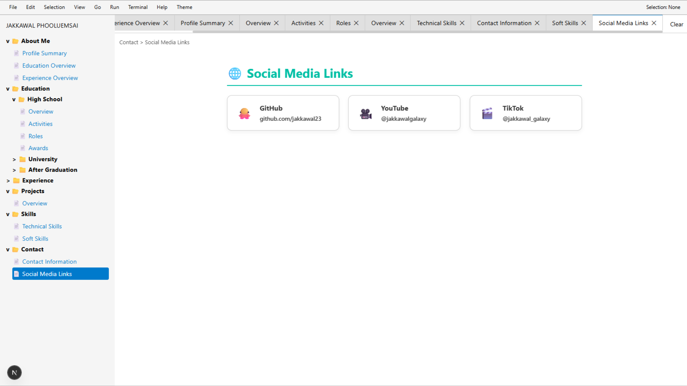

# VS Code Style Portfolio - Next.js


เว็บไซต์พอร์ตโฟลิโอส่วนตัวที่ถูกออกแบบมาให้มีหน้าตาและประสบการณ์การใช้งาน (UI/UX) เหมือนกับโปรแกรม Visual Studio Code ที่เหล่านักพัฒนาคุ้นเคย เพื่อแสดงข้อมูลประวัติส่วนตัว ทักษะ และผลงานในรูปแบบที่สร้างสรรค์

## 🚀 Features

* VS Code Theme UI: จำลองหน้าจอโปรแกรม Code Editor ทั้งส่วน Sidebar, File Explorer และ Tab System

* Responsive Design: รองรับการแสดงผลทุกหน้าจอ รวมถึงการปรับแต่งให้ดูดีบนมือถือ

* Dynamic Content: แสดงข้อมูลประวัติการศึกษาและประสบการณ์ทำงานในรูปแบบไฟล์ .tsx

* Interactive Explorer: สามารถคลิกเลือก "ไฟล์" เพื่อเปลี่ยนหน้าแสดงข้อมูลได้เหมือนการใช้งานจริง


## 🛠️ Getting Started
First, run the development server:

```bash
npm run dev
# or
yarn dev
# or
pnpm dev
# or
bun dev
```


Open http://localhost:3000 with your browser to see the result.


You can start editing the page by modifying app/page.tsx. The page auto-updates as you edit the file.


This project uses next/font to automatically optimize and load Geist, a new font family for Vercel.


## 📖 Project Structure


* app/ - ไฟล์หลักของ Next.js App Router

* components/ - ส่วนประกอบของ UI เช่น Sidebar, Editor, ActivityBar

* files/ - เก็บข้อมูล Mock Data (Education, Experiences, Activities)


## Example web







